<div align="center">


# Sitzplan Studio

**Klassen verwalten, Räume maßstabsgetreu zeichnen, Sitzpläne stellen —
ein Werkzeug für Lehrkräfte, kein Dashboard.**

[](https://github.com/arn0ld87/sitzplan-studio)
[](#aktueller-produktstatus)
[](https://react.dev/)
[](https://tanstack.com/start)
[](https://www.typescriptlang.org/)
[](https://tailwindcss.com/)
[](https://supabase.com/)
[](LICENSE)

<br>

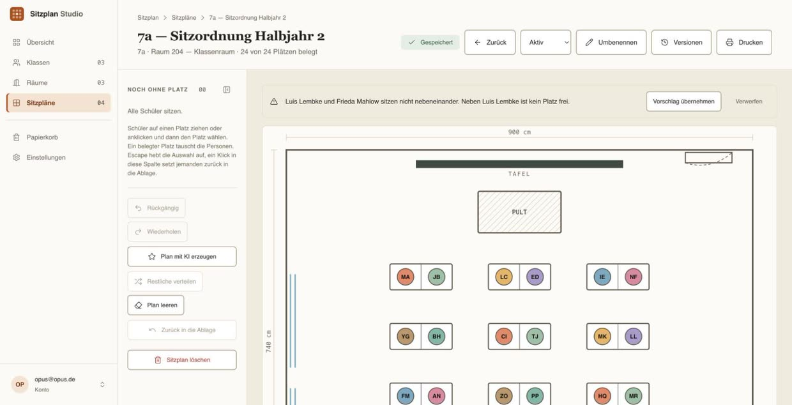

_Die Klasse sitzt. Zwei Schüler, die nebeneinander sitzen müssen, tun es nicht —
die App sagt es, bevor die Stunde beginnt._

</div>

---

## Inhalt

- [Die Idee in einem Absatz](#die-idee-in-einem-absatz)
- [Drei Schritte, ein Sitzplan](#drei-schritte-ein-sitzplan)
- [Was das im Alltag spart](#was-das-im-alltag-spart)
- [Funktionen](#funktionen)
- [Schnellstart](#schnellstart)
- [Architektur & Stack](#architektur--stack)
- [Datenmodell](#datenmodell)
- [Aktueller Produktstatus](#aktueller-produktstatus)
- [Release-Weg](#release-weg)
- [Sicherheit & Datenschutz](#sicherheit--datenschutz)
- [Mitarbeit & Konventionen](#mitarbeit--konventionen)
- [Lizenz & Herkunft](#lizenz--herkunft)

---

## Die Idee in einem Absatz

Ein Sitzplan ist schnell gemalt und teuer gepflegt: Ein Schüler zieht um, zwei
dürfen nicht nebeneinander, der Raum wechselt — und die Zeichnung auf Papier
stimmt nicht mehr. Sitzplan Studio hält die drei Dinge auseinander, die
tatsächlich verschieden sind: **die Klasse**, **den Raum** und **den Plan**, der
beide verbindet. Die Klasse zieht durch mehrere Räume, der Raum trägt mehrere
Klassen, und jeder Plan behält seine eigene, eingefrorene Kopie des Grundrisses.
Wer die Raumvorlage im März umbaut, zerschießt damit keinen Plan vom September.

Die Oberfläche ist durchgängig deutschsprachig und folgt einem festen
Designsystem — siehe [`docs/designsystem.md`](docs/designsystem.md). Leitidee:
„Modernes Klassenatelier und digitaler Lehrertisch". Ruhig, warm, technisch
präzise. Kein generisches SaaS-Dashboard, kein Dark Mode, keine Farbverläufe.

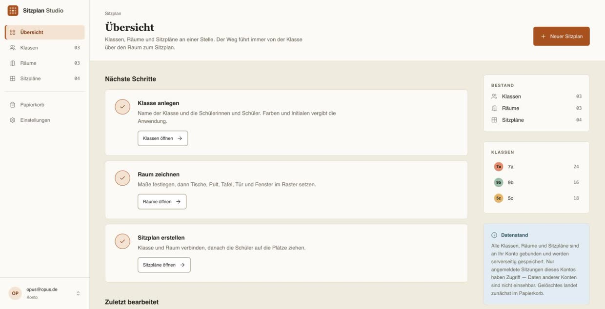

---

## Drei Schritte, ein Sitzplan

### 1 · Die Klasse steht — samt dem, was sonst nur im Kopf ist

Schülerinnen und Schüler bekommen automatisch Initialen und eine Farbe, die sich
nicht mehr ändert. Dazu, was für die Sitzordnung wirklich zählt: Besonderheiten
und eine Notiz je Person.

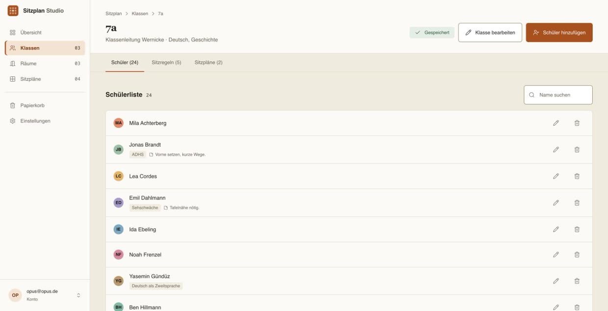

Sitzregeln sind Paarregeln — **muss neben** oder **nicht neben**. Sie werden
einmal notiert und gelten für jeden Plan dieser Klasse, in jedem Raum.

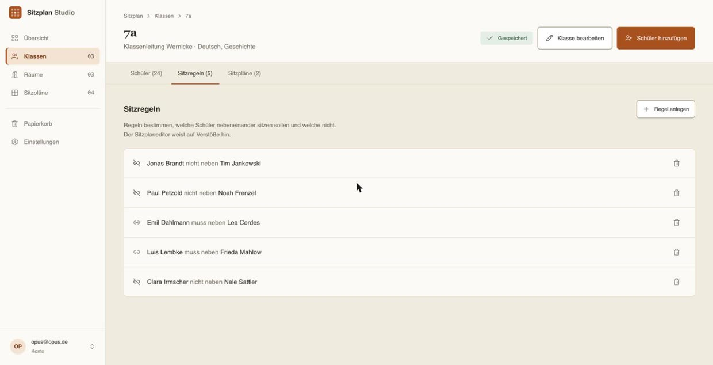

### 2 · Der Raum wird einmal gezeichnet

Echte Maße in Zentimetern, Raster ab 5 cm, Einzel- und Doppeltische, Pult,
Tafel, Tür und Fenster. Einmal messen, jedes Halbjahr nutzen.

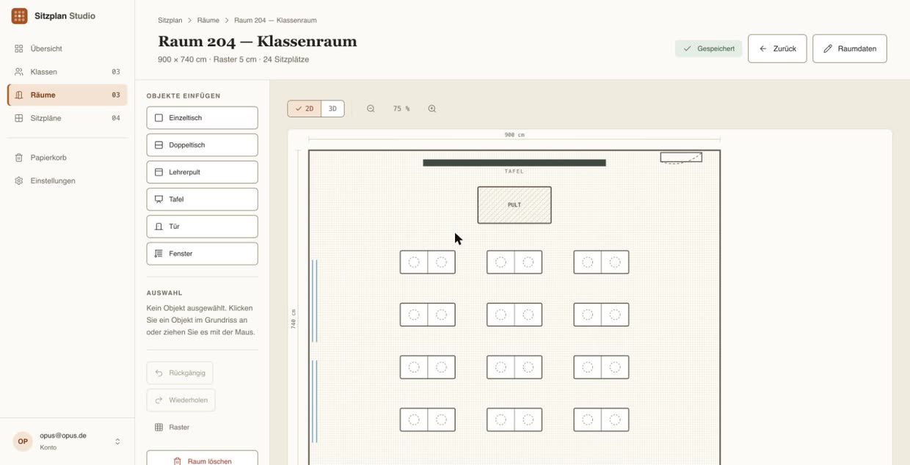

Ob die Reihe wirklich an der Tafel vorbeischaut, zeigt die 3D-Ansicht besser als
jeder Grundriss:

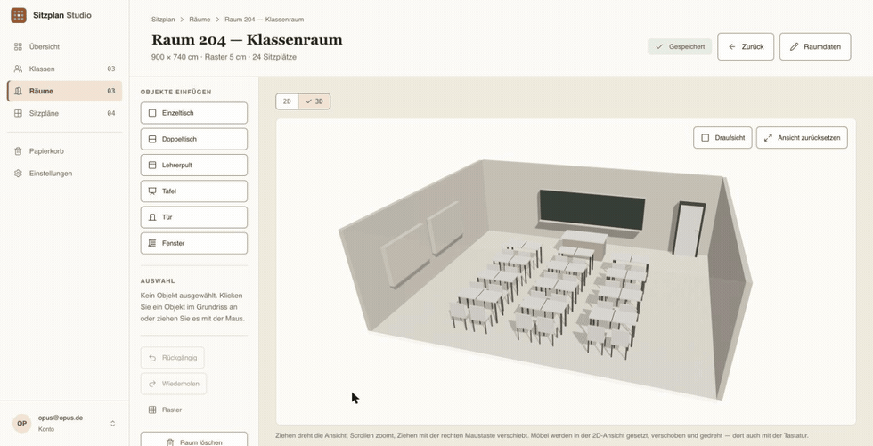

### 3 · Der Plan verbindet beides

Schüler kommen per Drag-and-drop auf die Plätze — oder per Klick, was mit der
Tastatur bedienbar ist und nebenbei schneller geht. Ein belegter Platz tauscht
die Personen:

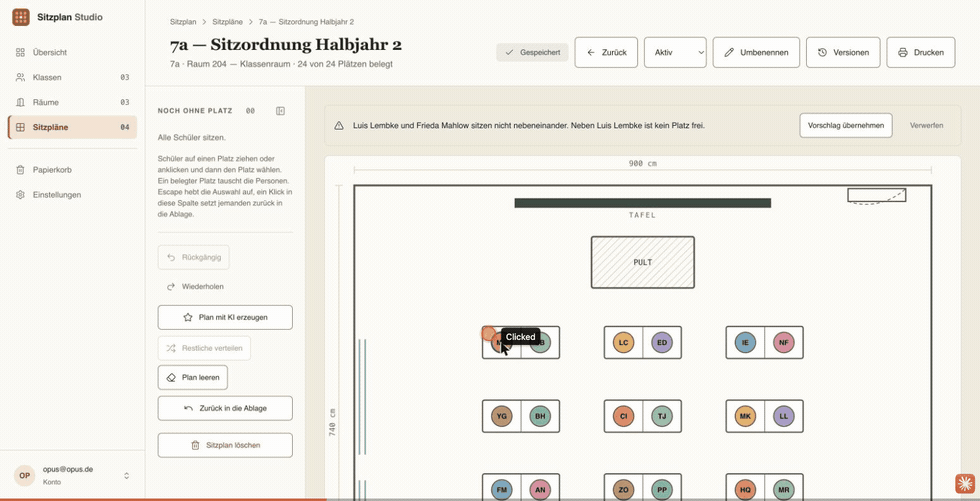

Verstößt die Sitzordnung gegen eine Regel, sagt die App es — mit Namen, Grund
und einem Vorschlag, den man übernehmen **oder** verwerfen kann. Nichts ändert
sich von selbst.

Alle Pläne einer Klasse liegen nebeneinander, jeder mit eigenem Raum, eigenem
Belegungsstand und eigenem Status:

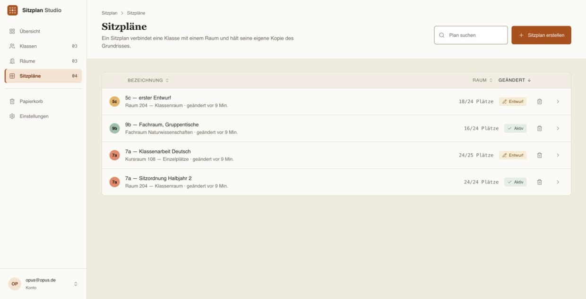

### Und auf dem Telefon

Klassen und Schülerlisten lassen sich unterwegs pflegen. Gezeichnet und gestellt
wird am Rechner — dafür braucht es Fläche.

<p align="center">
  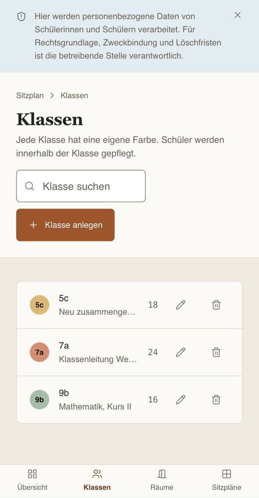
</p>

---

## Was das im Alltag spart

| Anwendungsfall            | Beschreibung                                               | Nutzen                                            |
| ------------------------- | ---------------------------------------------------------- | ------------------------------------------------- |
| **Klassenarbeit stellen** | Reihen mit maximalem Abstand, Regeln „nicht nebeneinander" | Weniger Abschreiben, in Minuten statt Freistunden |
| **Gruppentische planen**  | Doppeltische, Zusammensetzung nach Regel „muss neben"      | Vorbereitete Kooperation statt Zufall             |
| **Vertretung übergeben**  | Druckansicht mit Namen und Plätzen                         | Vertretungskraft kennt die Klasse ohne Vorlauf    |
| **Raum einmal erfassen**  | Vorlage mit echten Maßen, mehrfach wiederverwendet         | Einmal messen, jedes Halbjahr nutzen              |

> [!WARNING]
> **Grenzen — bitte vor dem Produktiveinsatz lesen.**
>
> - **Schülerdaten sind personenbezogene Daten.** Namen von Minderjährigen in
>   einer Cloud-Datenbank sind in Deutschland nicht ohne Weiteres zulässig.
>   Vor dem Einsatz mit echten Klassen: Rücksprache mit Schulleitung und
>   Datenschutzbeauftragtem, Verarbeitungsverzeichnis, ggf. AVV mit dem Hoster.
>   Die App bringt dafür einen Hinweisbaustein mit, ersetzt aber keine Freigabe.
> - **Kein Klassenbuch, kein Notenprogramm.** Es gibt keine Leistungsdaten,
>   keine Fehlzeiten, keine Förderbedarfe — und das ist Absicht.
> - **Der Sitzvorschlag ist ein Vorschlag.** Er ändert nichts ohne Bestätigung
>   und ersetzt keine pädagogische Entscheidung.
> - **Einzelnutzer-Modell.** Jeder Datensatz gehört genau einem Konto. Es gibt
>   keine Freigabe an Kolleginnen und Kollegen, kein Team, keine Schulinstanz.
> - **Keine Selbstregistrierung.** Konten legt die betreibende Stelle im
>   Supabase-Dashboard an.

## Funktionen

- **Klassenverwaltung** — Schüler anlegen, Initialen und indexstabile Farbe
  automatisch, Besonderheiten und Notiz je Person, Notizfeld je Klasse.
- **Sitzregeln** — Paarregeln `nicht_neben` / `muss_neben` innerhalb einer Klasse.
- **Raumeditor** — Palette mit maßstäblicher Vorschau, Raster ab 5 cm, Drehung in
  90°-Schritten, Inspector mit editierbaren Koordinaten, Undo/Redo, Zoom,
  2D-Grundriss und 3D-Ansicht.
- **Sitzplaneditor** — Schülerablage, Zuweisung per Klick _oder_ Drag-and-drop,
  Konflikte als Warnring **plus** Marke (nie nur Farbe), Tauschvorschläge mit
  Vorher/Nachher und Begründung.
- **Vorschlag per KI** — „Plan mit KI erzeugen" über die Edge Function
  `ki-sitzplan`; der Schlüssel bleibt serverseitig
  ([ADR-0007](docs/decisions/0007-ki-vorschlaege-ueber-edge-function.md)).
- **Druckansicht** — eigene Route `/sitzplaene/$id/drucken`, Besonderheiten und
  Notizen wahlweise mitdrucken.
- **Papierkorb** — Soft-Delete über `deleted_at` für Klassen, Räume und Pläne;
  Löschen ist rückholbar statt endgültig.
- **Speicherstatus** — sechs Zustände (gespeichert, Änderungen, speichert,
  offline gesichert, Serverkonflikt, nicht gespeichert), jeweils Symbol **und**
  Text, mit `aria-live="polite"`.
- **Konto in eigener Hand** — Passwort ändern, alle Daten als JSON exportieren,
  Konto samt Daten löschen.
- **Barrierefreiheit** — Ziel WCAG 2.2 AA: Tastaturbedienung gleichwertig zu
  Drag-and-drop, sichtbarer Fokusstil, Form vor Farbe, `prefers-reduced-motion`.

## Schnellstart

Voraussetzung: [Bun](https://bun.sh) (das Repo pflegt `bun.lock` und `bunfig.toml`)
sowie ein Supabase-Projekt.

```bash
git clone https://github.com/arn0ld87/sitzplan-studio.git
cd sitzplan-studio
bun install
```

Umgebungsvariablen in `.env` — Vorlage: `.env.example`. Die `VITE_`-Variablen
liest der Browser, die gleichnamigen ohne Präfix der SSR-Teil; beide zeigen auf
dasselbe Projekt und tragen denselben **Publishable Key**:

```dotenv
VITE_SUPABASE_URL=https://<projekt>.supabase.co
VITE_SUPABASE_PUBLISHABLE_KEY=<publishable-key>
VITE_SUPABASE_PROJECT_ID=<projekt-id>
SUPABASE_URL=https://<projekt>.supabase.co
SUPABASE_PUBLISHABLE_KEY=<publishable-key>
SUPABASE_PROJECT_ID=<projekt-id>
```

Vite liest `.env` nur beim Start — nach jeder Änderung den Dev-Server neu
starten, sonst arbeitet die App weiter gegen das alte Projekt.

### Nur auf dem Server: der Service-Role-Key

**Einstellungen → Konto löschen** räumt alle Tabellen des Kontos ab und entfernt
danach den Auth-Datensatz. Das geht bewusst an der RLS vorbei und braucht
deshalb eine siebte Variable:

```dotenv
SUPABASE_SERVICE_ROLE_KEY=<service-role-key>
```

> [!CAUTION]
> Dieser Schlüssel hebelt **jede** RLS-Policy aus. Er gehört ausschließlich in
> die lokale, nicht versionierte `.env` und in die Secrets der Hosting-Umgebung.
> Niemals in `.env.example`, niemals in eine `VITE_`-Variable — die schreibt
> Vite beim Bauen in das ausgelieferte JavaScript — und niemals in einen Commit.

Fehlt er, läuft die App vollständig; allein „Konto löschen" bricht mit
`Fehlende Supabase-Umgebungsvariablen: SUPABASE_SERVICE_ROLE_KEY` ab.

### Der Gemini-Schlüssel gehört nirgends in dieses Repo

„Plan mit KI erzeugen" läuft über die Edge Function `ki-sitzplan`. Ihr Schlüssel
ist ein **Supabase-Secret** und wird nie ausgeliefert — genau deshalb gibt es die
Funktion ([ADR-0007](docs/decisions/0007-ki-vorschlaege-ueber-edge-function.md)):

```bash
# Schlüssel nicht auf die Kommandozeile — dort landet er in der Prozessliste
# und in der Shell-Historie. Datei anlegen, setzen, löschen:
printf 'GEMINI_API_KEY=%s\n' '<schlüssel>' > .gemini.env
supabase secrets set --env-file .gemini.env
rm .gemini.env

supabase functions deploy ki-sitzplan --use-api
```

`--use-api` lässt Supabase serverseitig bündeln. Ohne das Flag baut das CLI die
Funktion lokal in Docker und lädt dafür das `edge-runtime`-Image — was hinter
einem Proxy in einen Timeout laufen kann (`failed to bundle function: exit 125`).
Das Flag umgeht Docker vollständig; das Ergebnis ist dasselbe.

Ohne gesetztes Secret antwortet die Funktion mit `kein_schluessel`; die übrige
App bleibt davon unberührt. Ein `VITE_GEMINI_API_KEY` wäre nach dem ersten Build
öffentlich und ist ausdrücklich kein Ersatz.

Schema einspielen und starten:

```bash
supabase db push     # legt Tabellen, Trigger und RLS-Policies an
bun run dev          # http://localhost:5173
```

| Befehl            | Zweck                           |
| ----------------- | ------------------------------- |
| `bun run dev`     | Entwicklungsserver mit HMR      |
| `bun run build`   | Produktionsbuild                |
| `bun run preview` | Produktionsbuild lokal prüfen   |
| `bun run lint`    | ESLint über das gesamte Projekt |
| `bun run format`  | Prettier schreibt Formatierung  |

Zum Ausprobieren ohne echte Klassen legt
[`scripts/demo-daten.ts`](scripts/demo-daten.ts) drei Klassen, drei Räume und
vier Sitzpläne in ein bestehendes Konto — die Bilder oben stammen daraus:

```bash
bun run scripts/demo-daten.ts <e-mail> [--ersetzen]
```

Für den Betrieb hinter Traefik im Container:
[`docs/runbooks/deployment.md`](docs/runbooks/deployment.md).

## Architektur & Stack

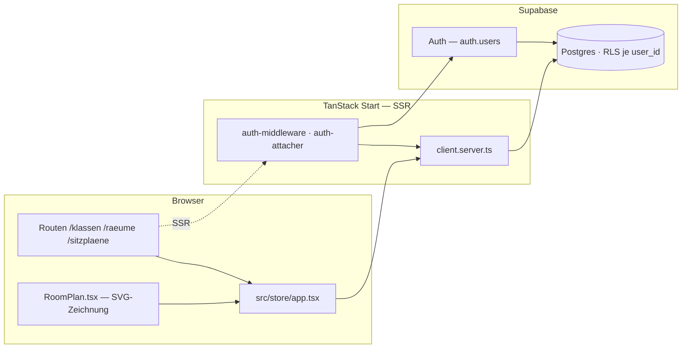

| Schicht        | Technik                                                         |
| -------------- | --------------------------------------------------------------- |
| Framework      | TanStack Start (SSR) + TanStack Router, dateibasierte Routen    |
| UI             | React 19, Tailwind CSS 4, Radix Primitives, shadcn-Konventionen |
| Eigenes UI-Kit | `src/components/ui-kit/` — Chips, SaveStatus, StatusChip, Modal |
| Zeichnung      | handgeschriebenes SVG, keine Canvas- oder Diagrammbibliothek    |
| Datenhaltung   | Supabase Postgres, Zugriff über `@supabase/supabase-js`         |
| Server-State   | TanStack Query                                                  |
| Formulare      | React Hook Form + Zod                                           |
| Icons          | `lucide-react`, 16 px, Strichstärke 1.5                         |
| Toolchain      | Vite 8, TypeScript 5.8, ESLint 9, Prettier, Bun                 |

Geometrie liegt als `canvas_document` (JSONB) an Raum und Sitzplan. Sitzplätze
folgen dem festen Muster `<objektId>__sitz_<n>` — siehe `seatId()` in
[`src/data/types.ts`](src/data/types.ts).

## Datenmodell

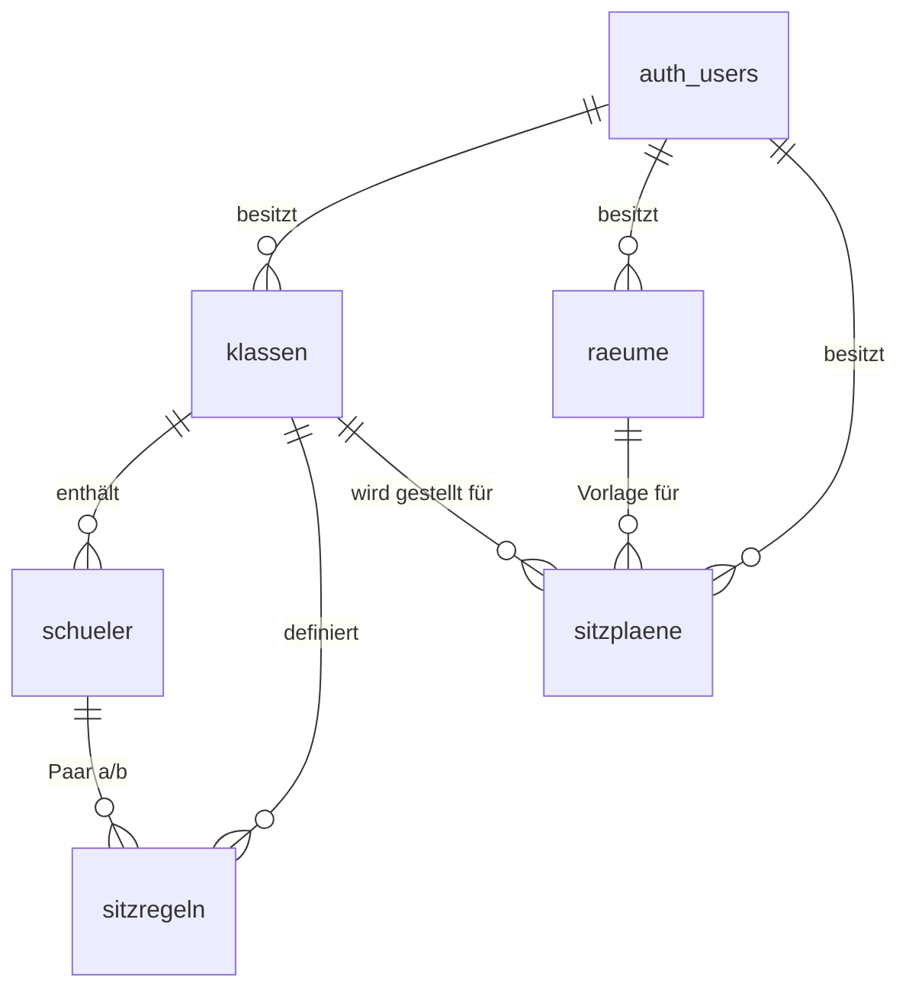

| Tabelle      | Kern-Spalten                                             | Anmerkung                           |
| ------------ | -------------------------------------------------------- | ----------------------------------- |
| `klassen`    | `name`, `notizen`                                        |                                     |
| `schueler`   | `vorname`, `nachname`, `initialen`, `klasse_id`          |                                     |
| `sitzregeln` | `schueler_a`, `schueler_b`, `art`                        | `art ∈ {nicht_neben, muss_neben}`   |
| `raeume`     | `breite_cm`, `laenge_cm`, `raster_cm`, `canvas_document` | `raster_cm >= 5`                    |
| `sitzplaene` | `klasse_id`, `raum_id`, `status`, `canvas_document`      | `status ∈ {entwurf, aktiv, archiv}` |

Jede Tabelle trägt `user_id` (FK auf `auth.users`, `ON DELETE CASCADE`),
`created_at`, `updated_at` (Trigger `set_updated_at`) und `deleted_at` für den
Papierkorb.

## Aktueller Produktstatus

| Bereich                              | Stand                                                     |
| ------------------------------------ | --------------------------------------------------------- |
| Designsystem & App-Shell             | ✅ umgesetzt                                              |
| Klassen, Schüler, Sitzregeln         | ✅ umgesetzt                                              |
| Raumeditor inkl. 3D-Ansicht          | ✅ umgesetzt                                              |
| Sitzplaneditor inkl. Konfliktprüfung | ✅ umgesetzt                                              |
| KI-Vorschlag über Edge Function      | ✅ umgesetzt                                              |
| Druckansicht                         | ✅ umgesetzt                                              |
| Papierkorb (Soft-Delete)             | ✅ umgesetzt                                              |
| Auth + RLS, Passwort ändern          | ✅ umgesetzt                                              |
| Automatisierte Tests                 | 🚧 Vitest eingerichtet, Datenschicht abgedeckt, keine E2E |
| CI-Pipeline                          | ❌ nicht eingerichtet                                     |
| CSV-Import für Schülerlisten         | 🚧 in der Oberfläche angelegt, ohne Funktion              |
| Mehrbenutzer-/Schulbetrieb           | ❌ nicht vorgesehen                                       |

## Release-Weg

- **Preview → 0.1.0** — E2E-Tests (Playwright) ergänzen, CI mit `typecheck`,
  `lint`, `test` und `build`, CSV-Import fertigstellen.
- **0.1.0 → 0.5.0** — Offline-Fähigkeit belastbar machen (der Speicherstatus
  verspricht sie bereits), Serverkonflikt-Auflösung, Undo/Redo im Sitzplaneditor.
- **0.5.0 → 1.0.0** — Datenschutzdokumentation, Export/Löschkonzept nach
  Art. 15/17 DSGVO, Barrierefreiheits-Audit gegen WCAG 2.2 AA.

## Sicherheit & Datenschutz

- **Row Level Security** ist auf allen Tabellen aktiv. Jede Policy prüft
  `user_id = auth.uid()`; abhängige Tabellen prüfen zusätzlich über
  `EXISTS (SELECT 1 FROM klassen …)`, dass die Elternzeile demselben Konto gehört.
- **Nur der Publishable Key** erreicht den Browser. Der Service-Role-Key wird
  ausschließlich serverseitig in `client.server.ts` gelesen, einzig für das
  Löschen eines Kontos — siehe [Schnellstart](#nur-auf-dem-server-der-service-role-key).
  In das Repository gehört er nicht.
- **`.env` ist nicht versioniert.** Sie steht in `.gitignore`; `.env.example`
  ist die Vorlage und enthält nur Platzhalter, keine Werte.
- **Soft-Delete ist kein Löschen.** Zeilen mit `deleted_at` bleiben in der
  Datenbank. Für eine DSGVO-konforme Löschung braucht es einen echten Purge-Job.

## Mitarbeit & Konventionen

- Arbeitsanweisungen für KI-Agenten: [`AGENTS.md`](AGENTS.md) (allgemein) und
  [`CLAUDE.md`](CLAUDE.md) (Claude Code).
- Architektur und Datenfluss: [`docs/architecture.md`](docs/architecture.md).
- Warum etwas so gebaut ist: [`docs/decisions/`](docs/decisions/) (ADRs).
- Vor dem Push: [`docs/runbooks/pre-push-gate.md`](docs/runbooks/pre-push-gate.md),
  Branch und Merge: [`docs/runbooks/pr-workflow.md`](docs/runbooks/pr-workflow.md),
  Produktivbetrieb: [`docs/runbooks/deployment.md`](docs/runbooks/deployment.md).
- Verbindliche Gestaltung: [`docs/designsystem.md`](docs/designsystem.md).
- Oberflächentexte, Bezeichner im Datenmodell und Routen sind **deutsch**
  (`klassen`, `raeume`, `sitzplaene`). Code-Bezeichner in `src/data/types.ts`
  sind historisch englisch — beim Anfassen angleichen, nicht großflächig umbauen.

> [!IMPORTANT]
> Veröffentlichte Historie darf **nicht** umgeschrieben werden — kein `--force`,
> kein Rebase, kein Amend auf bereits gepushten Commits. Offene Pull Requests
> und die Kommentare der Review-Bots hängen an den Commit-SHAs. Der Branch
> `main` muss jederzeit lauffähig sein.

## Lizenz & Herkunft

**[GNU AGPL 3.0](LICENSE)** — freie Software im Sinne der OSI. Nutzen,
verändern, weitergeben und selbst betreiben ist ausdrücklich erlaubt, auch
kommerziell. Für Lehrkräfte, Schulen und öffentliche Einrichtungen heißt das:
herunterladen, aufsetzen, benutzen — ohne Rückfrage, ohne Preisschild.

Die eine Bedingung ist die Gegenleistung an die Allgemeinheit: Wer eine
**veränderte** Fassung betreibt und sie anderen über ein Netzwerk zugänglich
macht, muss deren Quelltext denselben Nutzerinnen und Nutzern anbieten —
ebenfalls unter AGPL 3.0 (§ 13 der Lizenz). Wer die App unverändert für die
eigene Schule betreibt, hat damit nichts zu tun.

Copyright © 2026 Alexander Schneider. Frühere Fassungen dieses Repositorys
standen unter PolyForm Noncommercial 1.0.0; ab dem Wechsel auf AGPL 3.0 gilt für
alle weiteren Veröffentlichungen diese Lizenz. Fragen zur Lizenz gern
[als Issue](https://github.com/arn0ld87/sitzplan-studio/issues).

Die Bilder in dieser Datei zeigen ausschließlich erfundene Klassen und Namen aus
[`scripts/demo-daten.ts`](scripts/demo-daten.ts) — keine echten Schülerdaten.

Der erste Aufschlag entstand mit [Lovable](https://lovable.dev); der
Repository-Sync ist seit Juli 2026 gekappt, die Build-Konfiguration
(`@lovable.dev/vite-tanstack-config`) blieb. Gepflegt von
[Alexander Schneider](https://github.com/arn0ld87).
