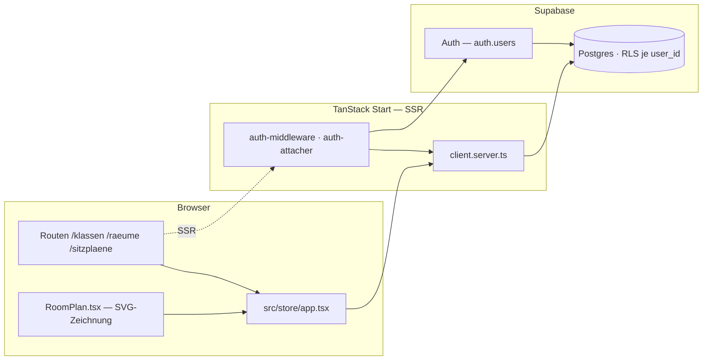
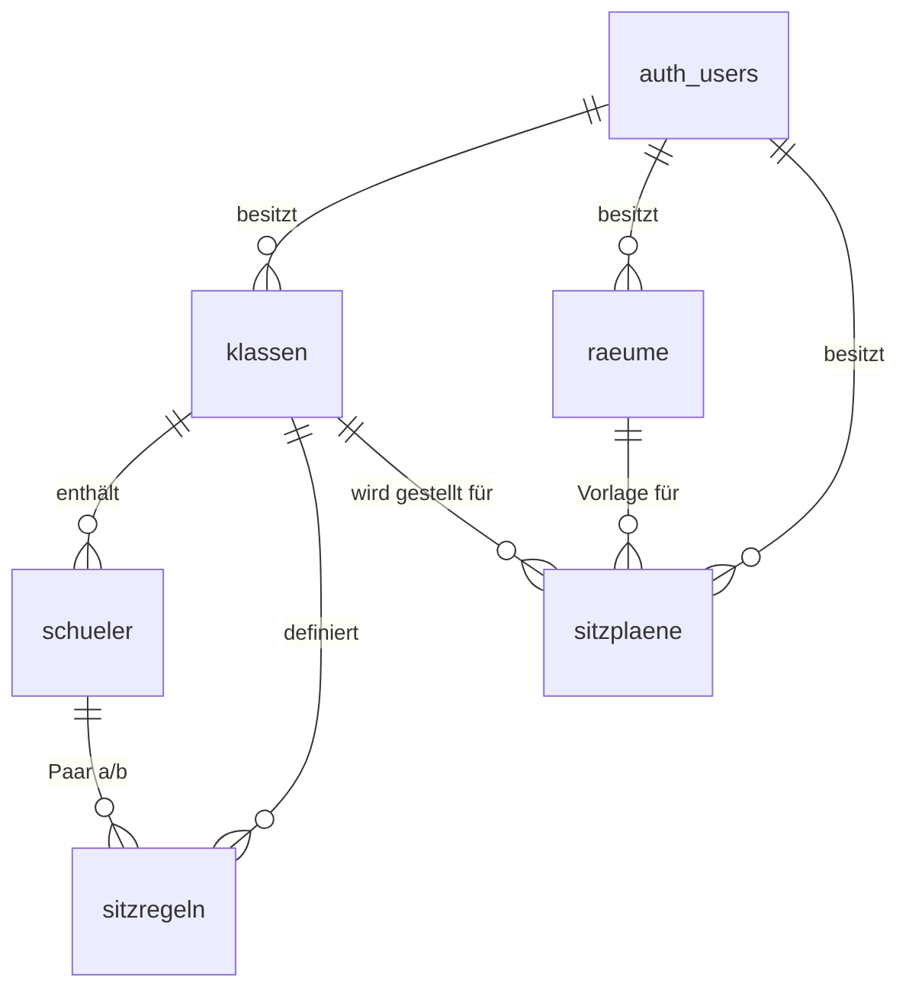

<div align="center">


# Sitzplan Studio

**Klassen verwalten, Räume maßstabsgetreu zeichnen, Sitzpläne stellen — ein Werkzeug für Lehrkräfte, kein Dashboard.**

[](https://github.com/arn0ld87/sitzplan-studio)
[](#aktueller-produktstatus)
[](https://react.dev/)
[](https://tanstack.com/start)
[](https://www.typescriptlang.org/)
[](https://tailwindcss.com/)
[](https://supabase.com/)

</div>

---

## Inhalt

- [Was ist Sitzplan Studio](#was-ist-sitzplan-studio)
- [Wofür es gedacht ist — und wofür nicht](#wofür-es-gedacht-ist--und-wofür-nicht)
- [Funktionen](#funktionen)
- [Schnellstart](#schnellstart)
- [Architektur & Stack](#architektur--stack)
- [Datenmodell](#datenmodell)
- [Aktueller Produktstatus](#aktueller-produktstatus)
- [Release-Weg](#release-weg)
- [Sicherheit & Datenschutz](#sicherheit--datenschutz)
- [Mitarbeit & Konventionen](#mitarbeit--konventionen)
- [Lizenz & Herkunft](#lizenz--herkunft)

---

## Was ist Sitzplan Studio

Sitzplan Studio ist eine Web-App, mit der Lehrkräfte drei Dinge zusammenbringen:

1. **Klassen** — Schülerlisten mit stabilen Farben und Initialen, dazu Sitzregeln
   („darf nicht neben", „muss neben").
2. **Räume** — maßstabsgetreue Grundrisse als SVG-Zeichnung: Wände, Raster in
   Zentimetern, Einzel- und Doppeltische, Lehrerpult, Tafel, Tür, Fenster.
3. **Sitzpläne** — die Zuordnung Schüler → Sitzplatz, inklusive Konfliktprüfung
   gegen die Sitzregeln und druckbarer Ansicht.

Ein Sitzplan friert die Raumgeometrie zum Zeitpunkt des Anlegens ein. Wer die
Raumvorlage später umbaut, zerschießt damit keine bestehenden Pläne.

Die Oberfläche ist durchgängig deutschsprachig und folgt einem festen
Designsystem — siehe [`docs/designsystem.md`](docs/designsystem.md). Leitidee:
„Modernes Klassenatelier und digitaler Lehrertisch". Ruhig, warm, technisch
präzise. Kein generisches SaaS-Dashboard, kein Dark Mode, keine Farbverläufe.

## Wofür es gedacht ist — und wofür nicht

| Anwendungsfall | Beschreibung | Nutzen |
| --- | --- | --- |
| **Klassenarbeit stellen** | Reihen mit maximalem Abstand, Regeln „nicht nebeneinander" | Weniger Abschreiben, in Minuten statt Freistunden |
| **Gruppentische planen** | Doppeltische, Zusammensetzung nach Regel „muss neben" | Vorbereitete Kooperation statt Zufall |
| **Vertretung übergeben** | Druckansicht mit Namen und Plätzen | Vertretungskraft kennt die Klasse ohne Vorlauf |
| **Raum einmal erfassen** | Vorlage mit echten Maßen, mehrfach wiederverwendet | Einmal messen, jedes Halbjahr nutzen |

> [!WARNING]
> **Grenzen — bitte vor dem Produktiveinsatz lesen.**
>
> - **Schülerdaten sind personenbezogene Daten.** Namen von Minderjährigen in
>   einer Cloud-Datenbank sind in Deutschland nicht ohne Weiteres zulässig.
>   Vor dem Einsatz mit echten Klassen: Rücksprache mit Schulleitung und
>   Datenschutzbeauftragtem, Verarbeitungsverzeichnis, ggf. AVV mit dem Hoster.
>   Die App bringt dafür einen Hinweisbaustein mit, ersetzt aber keine Freigabe.
> - **Kein Klassenbuch, kein Notenprogramm.** Es gibt keine Leistungsdaten,
>   keine Fehlzeiten, keine Förderbedarfe — und das ist Absicht.
> - **Der Sitzvorschlag ist ein Vorschlag.** Er ändert nichts ohne Bestätigung
>   und ersetzt keine pädagogische Entscheidung.
> - **Einzelnutzer-Modell.** Jeder Datensatz gehört genau einem Konto. Es gibt
>   keine Freigabe an Kolleginnen und Kollegen, kein Team, keine Schulinstanz.

## Funktionen

- **Klassenverwaltung** — Schüler anlegen, Initialen und indexstabile Farbe
  automatisch, Notizfeld je Klasse.
- **Sitzregeln** — Paarregeln `nicht_neben` / `muss_neben` innerhalb einer Klasse.
- **Raumeditor** — Palette mit maßstäblicher Vorschau, Raster ab 5 cm, Drehung in
  90°-Schritten, Inspector mit editierbaren Koordinaten, Undo/Redo, Zoom.
- **Sitzplaneditor** — Schülerablage, Zuweisung per Klick *oder* Drag-and-drop,
  Konflikte als Warnring **plus** Marke (nie nur Farbe), Tauschvorschläge mit
  Vorher/Nachher und Begründung.
- **Druckansicht** — eigene Route `/sitzplaene/$id/drucken`.
- **Papierkorb** — Soft-Delete über `deleted_at` für Klassen, Räume und Pläne;
  Löschen ist rückholbar statt endgültig.
- **Speicherstatus** — sechs Zustände (gespeichert, Änderungen, speichert,
  offline gesichert, Serverkonflikt, nicht gespeichert), jeweils Symbol **und**
  Text, mit `aria-live="polite"`.
- **Barrierefreiheit** — Ziel WCAG 2.2 AA: Tastaturbedienung gleichwertig zu
  Drag-and-drop, sichtbarer Fokusstil, Form vor Farbe, `prefers-reduced-motion`.

## Schnellstart

Voraussetzung: [Bun](https://bun.sh) (das Repo pflegt `bun.lock` und `bunfig.toml`)
sowie ein Supabase-Projekt.

```bash
git clone https://github.com/arn0ld87/sitzplan-studio.git
cd sitzplan-studio
bun install
```

Umgebungsvariablen in `.env` — die App liest ausschließlich den **Publishable Key**
(anon), niemals den Service-Role-Key:

```dotenv
VITE_SUPABASE_URL=https://<projekt>.supabase.co
VITE_SUPABASE_PUBLISHABLE_KEY=<anon-key>
VITE_SUPABASE_PROJECT_ID=<projekt-id>
```

Schema einspielen und starten:

```bash
supabase db push     # legt Tabellen, Trigger und RLS-Policies an
bun run dev          # http://localhost:5173
```

| Befehl | Zweck |
| --- | --- |
| `bun run dev` | Entwicklungsserver mit HMR |
| `bun run build` | Produktionsbuild |
| `bun run preview` | Produktionsbuild lokal prüfen |
| `bun run lint` | ESLint über das gesamte Projekt |
| `bun run format` | Prettier schreibt Formatierung |

## Architektur & Stack



| Schicht | Technik |
| --- | --- |
| Framework | TanStack Start (SSR) + TanStack Router, dateibasierte Routen |
| UI | React 19, Tailwind CSS 4, Radix Primitives, shadcn-Konventionen |
| Eigenes UI-Kit | `src/components/ui-kit/` — Chips, SaveStatus, StatusChip, Modal |
| Zeichnung | handgeschriebenes SVG, keine Canvas- oder Diagrammbibliothek |
| Datenhaltung | Supabase Postgres, Zugriff über `@supabase/supabase-js` |
| Server-State | TanStack Query |
| Formulare | React Hook Form + Zod |
| Icons | `lucide-react`, 16 px, Strichstärke 1.5 |
| Toolchain | Vite 8, TypeScript 5.8, ESLint 9, Prettier, Bun |

Geometrie liegt als `canvas_document` (JSONB) an Raum und Sitzplan. Sitzplätze
folgen dem festen Muster `<objektId>__sitz_<n>` — siehe `seatId()` in
[`src/data/types.ts`](src/data/types.ts).

## Datenmodell



| Tabelle | Kern-Spalten | Anmerkung |
| --- | --- | --- |
| `klassen` | `name`, `notizen` | |
| `schueler` | `vorname`, `nachname`, `initialen`, `klasse_id` | |
| `sitzregeln` | `schueler_a`, `schueler_b`, `art` | `art ∈ {nicht_neben, muss_neben}` |
| `raeume` | `breite_cm`, `laenge_cm`, `raster_cm`, `canvas_document` | `raster_cm >= 5` |
| `sitzplaene` | `klasse_id`, `raum_id`, `status`, `canvas_document` | `status ∈ {entwurf, aktiv, archiv}` |

Jede Tabelle trägt `user_id` (FK auf `auth.users`, `ON DELETE CASCADE`),
`created_at`, `updated_at` (Trigger `set_updated_at`) und `deleted_at` für den
Papierkorb.

## Aktueller Produktstatus

| Bereich | Stand |
| --- | --- |
| Designsystem & App-Shell | ✅ umgesetzt |
| Klassen, Schüler, Sitzregeln | ✅ umgesetzt |
| Raumeditor | ✅ umgesetzt |
| Sitzplaneditor inkl. Konfliktprüfung | ✅ umgesetzt |
| Druckansicht | ✅ umgesetzt |
| Papierkorb (Soft-Delete) | ✅ umgesetzt |
| Auth + RLS | ✅ umgesetzt |
| Automatisierte Tests | 🚧 Vitest eingerichtet, Datenschicht abgedeckt, keine E2E |
| CI-Pipeline | ❌ nicht eingerichtet |
| CSV-Import für Schülerlisten | 🚧 in der Oberfläche angelegt, ohne Funktion |
| Mehrbenutzer-/Schulbetrieb | ❌ nicht vorgesehen |

## Release-Weg

- **Preview → 0.1.0** — E2E-Tests (Playwright) ergänzen, CI mit `typecheck`,
  `lint`, `test` und `build`, CSV-Import fertigstellen.
- **0.1.0 → 0.5.0** — Offline-Fähigkeit belastbar machen (der Speicherstatus
  verspricht sie bereits), Serverkonflikt-Auflösung, Undo/Redo im Sitzplaneditor.
- **0.5.0 → 1.0.0** — Datenschutzdokumentation, Export/Löschkonzept nach
  Art. 15/17 DSGVO, Barrierefreiheits-Audit gegen WCAG 2.2 AA.

## Sicherheit & Datenschutz

- **Row Level Security** ist auf allen Tabellen aktiv. Jede Policy prüft
  `user_id = auth.uid()`; abhängige Tabellen prüfen zusätzlich über
  `EXISTS (SELECT 1 FROM klassen …)`, dass die Elternzeile demselben Konto gehört.
- **Nur der Publishable Key** (anon) erreicht den Browser. Der Service-Role-Key
  gehört nirgendwo in dieses Repo.
- **`.env` ist derzeit eingecheckt.** Sie enthält ausschließlich Projekt-URL und
  anon-Key — beides ist bei Supabase per Design öffentlich und ohne RLS-Lücke
  wertlos. Trotzdem: Für abweichende Umgebungen `.env.local` nutzen und den
  Eintrag in `.gitignore` nachziehen.
- **Soft-Delete ist kein Löschen.** Zeilen mit `deleted_at` bleiben in der
  Datenbank. Für eine DSGVO-konforme Löschung braucht es einen echten Purge-Job.

## Mitarbeit & Konventionen

- Arbeitsanweisungen für KI-Agenten: [`AGENTS.md`](AGENTS.md) (allgemein) und
  [`CLAUDE.md`](CLAUDE.md) (Claude Code).
- Architektur und Datenfluss: [`docs/architecture.md`](docs/architecture.md).
- Warum etwas so gebaut ist: [`docs/decisions/`](docs/decisions/) (ADRs).
- Vor dem Push: [`docs/runbooks/pre-push-gate.md`](docs/runbooks/pre-push-gate.md),
  Branch und Merge: [`docs/runbooks/pr-workflow.md`](docs/runbooks/pr-workflow.md).
- Verbindliche Gestaltung: [`docs/designsystem.md`](docs/designsystem.md).
- Oberflächentexte, Bezeichner im Datenmodell und Routen sind **deutsch**
  (`klassen`, `raeume`, `sitzplaene`). Code-Bezeichner in `src/data/types.ts`
  sind historisch englisch — beim Anfassen angleichen, nicht großflächig umbauen.

> [!IMPORTANT]
> Veröffentlichte Historie darf **nicht** umgeschrieben werden — kein `--force`,
> kein Rebase, kein Amend auf bereits gepushten Commits. Offene Pull Requests
> und die Kommentare der Review-Bots hängen an den Commit-SHAs. Der Branch
> `main` muss jederzeit lauffähig sein.

## Lizenz & Herkunft

Für dieses Repository ist **keine Lizenz** hinterlegt. Damit gilt das
gesetzliche Urheberrecht: alle Rechte vorbehalten, keine Nutzung oder
Weitergabe ohne Zustimmung. Wer Open Source möchte, legt eine `LICENSE` an.

Der erste Aufschlag entstand mit [Lovable](https://lovable.dev); der
Repository-Sync ist seit Juli 2026 gekappt, die Build-Konfiguration
(`@lovable.dev/vite-tanstack-config`) blieb. Gepflegt von
[Alexander Schneider](https://github.com/arn0ld87).
